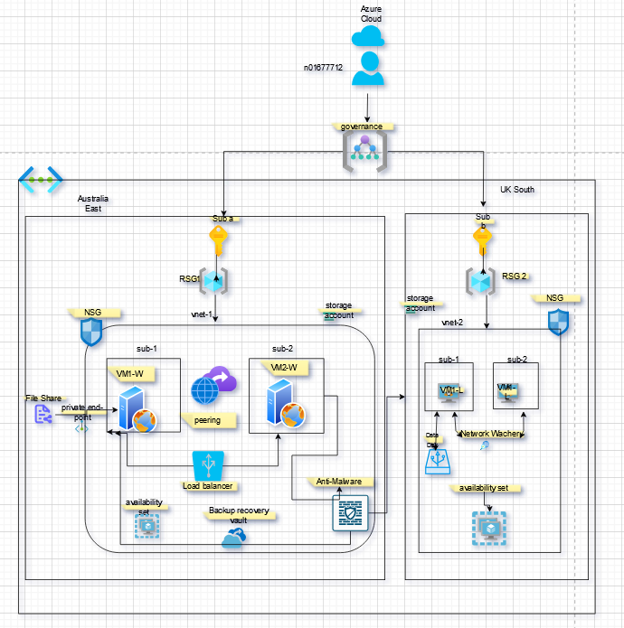
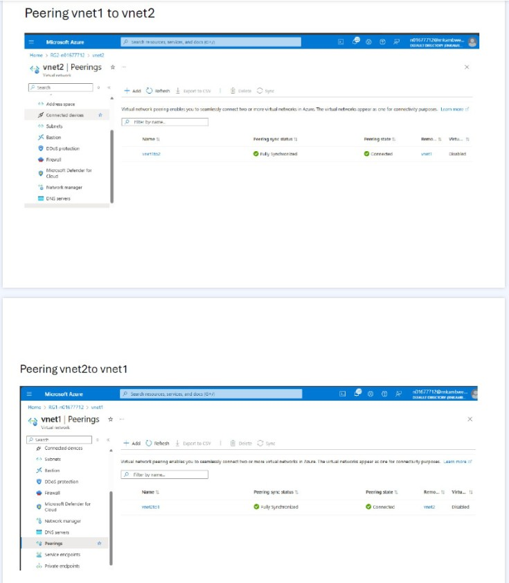
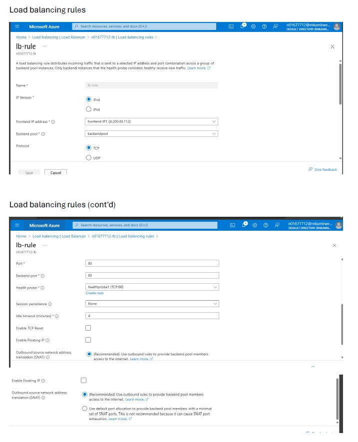
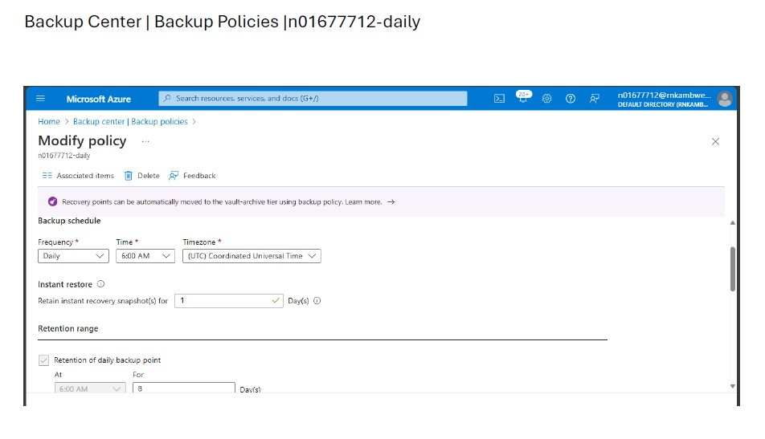
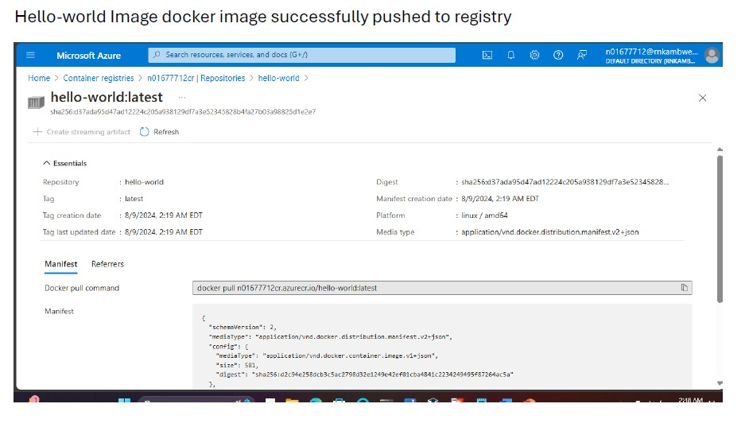

# Azure Hybrid Cloud Infrastructure Deployment

## Project Overview

This capstone project simulates a real-world enterprise cloud architecture, demonstrating the design, deployment, and management of a secure, highly available Azure infrastructure across two geographic regions. The environment was built using a combination of Azure Portal, Azure CLI, and PowerShell, showcasing proficiency in infrastructure-as-code principles, governance, security, and operational resilience.

**Technologies Used:** Microsoft Azure, Azure Virtual Networks, Network Security Groups, Azure Load Balancer, Azure Policy, Microsoft Entra ID (Azure AD), Recovery Services Vault, Azure Container Instances, Azure CLI, PowerShell

---

## Architecture Diagram

---

## Technical Architecture & Implementation

### Network Topology & Connectivity

- Designed and deployed a **hub-and-spoke network topology** across two Azure regions (Australia East and UK South), supporting hybrid connectivity and cross-region communication.
- Provisioned two virtual networks with CIDR ranges **10.10.0.0/23** (vnet1) and **10.20.0.0/23** (vnet2), each segmented into two `/24` subnets for workload isolation.
- Established **VNet peering** between regions, enabling seamless, low-latency communication between resources across subscriptions while maintaining network segmentation.

### VNet Peering

- Implemented **Network Security Groups (NSGs)** with granular inbound rules:
  - **vnet1-nsg:** RDP (3389), HTTP (80), SMB (445) for Windows workloads
  - **vnet2-nsg:** SSH (22) for Linux workloads
- Attached NSGs to all subnets, enforcing defense-in-depth and least-privilege access.

### Identity & Access Management (IAM)

- Created Azure AD user accounts with **Global Administrator** role assignment, establishing secure administrative access controls.
- Designed security groups with assigned membership, implementing role-based access control (RBAC) principles.
- Assigned **Owner RBAC role** at the subscription level for two separate subscriptions (`sub-a` and `sub-b`), enabling delegated administration and resource isolation.

### Governance & Compliance

- Implemented a **management group hierarchy** (`governance`) to enforce consistent policy application across all subscriptions and resources.
- Created a custom **policy initiative** (`project_initiative`) containing:
  - **Require a tag and its value on resources:** Enforced mandatory tagging (`environment: project`) for all resources, enabling cost tracking and operational visibility.
  - **Allowed locations:** Restricted resource creation to approved regions (Australia East, UK South) to ensure compliance with data residency requirements.
- Assigned the policy initiative to the management group and validated compliance across all deployed resources.

### Compute Resources & High Availability

- Deployed **four virtual machines** across both regions:
  - **Windows Server 2019 VMs** (`n01677712-w-vm1`, `n01677712-w-vm2`) in **availability set** (`windows-avs`), ensuring fault isolation and 99.95% SLA.
  - **Ubuntu Server 20.04 VMs** (`n01677712-u-vm1`, `n01677712-u-vm2`) in **availability set** (`linux-avs`), providing redundancy for Linux workloads.
- Provisioned **Standard SKU public IP addresses** with DNS labels for Windows VMs and **Basic SKU public IPs** for Linux VMs.
- Enabled **boot diagnostics** for all VMs, storing logs in regional storage accounts for troubleshooting and operational monitoring.
- Installed VM extensions:
  - **Microsoft Antimalware** on Windows VMs for threat protection.
  - **Network Watcher Agent for Linux** on Ubuntu VMs for enhanced network monitoring and diagnostics.

### Load Balancing & Application Delivery

- Deployed a **public Azure Load Balancer** (`n01677712-lb1`) with:
  - **Frontend IP configuration** using a public IP address.
  - **Backend pool** containing both Windows VMs for traffic distribution.
  - **Health probes** to monitor VM availability and automatically route traffic away from unhealthy instances.
  - **Load balancing rules** to distribute HTTP traffic (port 80) across backend VMs.
- Validated load balancer functionality by:
  - Accessing individual VM public IPs to confirm web server operation.
  - Testing the load balancer public IP to verify traffic distribution.
  - Performing failover tests by stopping individual VMs and confirming traffic redirection to healthy instances.
 
### Load Balancer Configuration

### Storage & Data Protection

- Provisioned **general-purpose LRS storage accounts** in each region (`n01677712storage1`, `n01677712storage2`) for VM boot diagnostics and file storage.
- Created **Azure File Share** (`n01677712-share1`) in storage account 1.
- Configured a **private endpoint** for the file share, enabling secure, private access over the Azure backbone network without exposing data to the public internet.
- Mounted the file share to a Windows VM as the **Z: drive** using the private IP address of the private endpoint, demonstrating hybrid storage integration.
- Created a test file (`n01677712`) on the mounted share to validate read/write access.

### Backup & Disaster Recovery

- Deployed a **Recovery Services Vault** (`n01677712-rsv1`) in region 1 for centralized backup management.
- Created a custom **backup policy** (`n01677712-daily`) with:
  - Daily backup schedule at **6:00 AM**.
  - **8-day retention** for daily backup points.
  - **1-day snapshot retention** for rapid recovery.
- Added both Windows VMs to the Recovery Services Vault and enabled automated backups.
- Triggered and validated **initial backups** for both VMs, confirming successful data protection configuration.

### Backup Policy

### Containerization

- Deployed an **Azure Container Instance** (`n01677712-aci1`) in region 2 using a **Hello World image** from Azure Container Registry.
- Configured a **custom DNS label** for the container, enabling public access via a user-friendly URL.
- Validated container deployment by accessing the web page through the DNS label in a browser.

### Azure Container Instance

For a complete collection of all screenshots, see [Azure_Project_Sreenshots.pdf](docs/Azure_Project_Sreenshots.pdf).

### Monitoring & Documentation

- Created a comprehensive **architecture diagram** in draw.io documenting:
  - Management group hierarchy
  - Subscription and resource group structure
  - Virtual network topology and subnet segmentation
  - VNet peering relationships
  - Availability sets and VM deployment
  - Storage accounts, file shares, and private endpoints
  - Load balancer configuration
  - Recovery Services Vault and backup policies
- Captured and organized **screenshots** for each implementation step, demonstrating thorough documentation practices and attention to detail.

---

## Key Technical Competencies Demonstrated

| **Competency** | **Implementation Details** |
| :--- | :--- |
| **Azure Infrastructure** | Deployed VMs, virtual networks (VNet), subnets, VNet peering, NSGs, storage accounts, Azure File Shares, and public load balancers |
| **Identity & Access Management** | Created Azure AD users, groups, RBAC roles, and implemented least-privilege access controls |
| **Governance & Compliance** | Built management groups, custom policy initiatives (tag enforcement, location restrictions), and validated compliance |
| **Security** | Configured NSGs, anti-malware extensions, private endpoints, and backup policies |
| **High Availability** | Deployed availability sets, load balancers with health probes, and tested failover scenarios |
| **Hybrid & Cross-Region** | Built resources across two Azure regions with VNet peering and cross-subscription connectivity |
| **Scripting & Automation** | Used Azure CLI and PowerShell for resource deployment and management |
| **Documentation** | Created architecture diagram and organized screenshots for operational handoff |

---

## Lessons Learned & Problem-Solving

- **Policy Compliance:** Ensured all resources met the custom policy initiative requirements (tagging and location restrictions), troubleshooting non-compliant resources to achieve full compliance.
- **Private Endpoint Configuration:** Successfully configured private endpoints for Azure File Share and validated connectivity using private IP addressing, demonstrating understanding of Azure networking and security best practices.
- **Load Balancer Testing:** Validated failover functionality by manually stopping VMs, confirming health probe detection and automatic traffic rerouting.
- **Governance Implementation:** Designed and enforced management group policies at scale, aligning with enterprise governance requirements.

---

## Future Enhancements

- Implement Infrastructure-as-Code using **Terraform** or **Bicep** for reproducible deployments.
- Integrate **Azure DevOps** for CI/CD pipelines to automate infrastructure updates.
- Enhance security with **Azure Sentinel** for SIEM and threat detection.
- Expand to additional Azure regions for geo-redundant disaster recovery.
- Implement **Azure Site Recovery** for full cross-region VM replication and failover.

---

## Author

**Robert Nkambwe**  
Student ID: N01677712  
Humber College – Cloud Infrastructure Azure Project  
August 2024

---

*This project was completed as part of the Cloud Infrastructure program at Humber College, Canada.*
